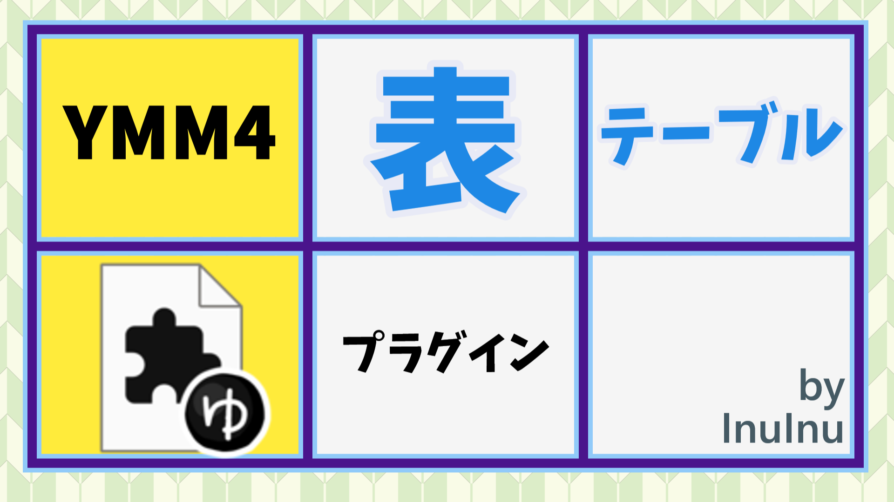

# 🟦 YMM4 表テーブルプラグイン

 

ゆっくりムービーメーカー4 (YMM4) 用の表を描ける図形プラグインです。

動画編集タイムライン上で表（テーブル）を描画する機能を追加します。表のセルには文字列を記入することもできます。

---

## 💡 こんな時に便利

- 動画内で見やすい表や一覧を作りたい
- セルごとに色やフォントを変えて強調したい
- 複数行・複数列の情報を分かりやすくまとめたい

## ⬇️ ダウンロード

GitHubの[リリースページ](https://github.com/InuInu2022/YMM4TableShapePlugin/releases)から最新の `YMM4TableShapePlugin.ymme` をダウンロードしてください。

YMM4 v4.45.1以降では公式のツールのプラグインポータル機能からダウンロード＆インストールもできます。

## 🛠️ 使い方

1. ダウンロードした `YMM4TableShapePlugin.ymme` をダブルクリックし、プラグインインストーラーを起動します。
   1. 「プラグインポータル」からもDL&インストールできます
2. YMM4を起動し、タイムラインに図形アイテムを追加します。
3. 図形の種類で「**表テーブル**」を選択します。
4. プロパティで行数・列数・セル内容・色・フォント等を設定します。

## ⚙️ 設定可能なプロパティ

### 📋 テーブル全体

- 幅・高さ（アニメーション可）
- 行数・列数（アニメーション可）
- 枠線の太さ・色
- 外枠の太さ・色
- 背景色
- セルの共通フォント・サイズ・色・装飾色
- セル文字装飾（太字・イタリック・アウトライン等）
- セルの配置（中央・左寄せ・右寄せなど）
- セル余白
- ヘッダー表示（なし／行／列／両方）
- ヘッダー行・列の背景色

### 🗂️ セル個別

共通のスタイルを上書きする、セルごとに個別のスタイルを設定できます。

- テキスト内容
- スタイル優先度（共通／個別上書き）
- フォント名・サイズ（アニメーション可）
- 文字色・装飾色
- 文字装飾（太字・イタリック・アウトライン等）
- セル余白
- 配置

### 🚫 できないこと

- セルの結合（対応予定あり）
- セルに画像を表示（対応したい）
- 行や列の挿入
- セル内の文字列にエフェクトをかける
- CSVやXLSX読み込み（対応したい）
- セル内容の自動サイズ調整（対応したい）

## 🏷️ 対応バージョン

- YMM4 v4.41～
  - v4.45でも動作確認済み

## 🔗 リンク

- [作者のGitHub](https://github.com/InuInu2022)
- [YMM4公式サイト](https://manjubox.net/ymm4/)

## 📄 ライセンス

> MIT License © 2025 - InuInu

- ライセンス詳細: [LICENSE](./LICENSE)
- 使用ライセンス一覧: [licenses/](./licenses/)